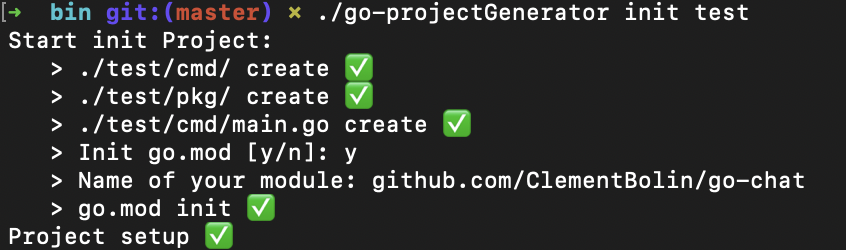

# Go-projectGenerator

## Introduction

why this project? I realized in the few go projects I've done, that there was no quick way to generate a standard project in Golang. So I created a go-projectGenerator to answer this problem, go-projectGenerator will generate a folder with a ```go.mod``` if you want, a ```Makefile```, a cmd folder where it will find your ```main.go``` and a pkg folder. So you will have a project that respects a good architecture to start coding in the best conditions. 


## How to install

if you don't have the Golang compiler please download it first [install Golang Compiler](https://golang.org)

    git clone https://github.com/ClementBolin/go-projectGenerator
    cd go-projectGenerator
    chmod +x install.sh
    ./install.sh

if ```install.sh``` failed you follow next instruction :

#### MacOs

    make build
    sudo cp ./bin/go-projectGenerator /usr/local/bin

#### Linux

    make build
    sudo cp ./bin/go-projectGenerator /usr/bin

## How to use

for run go-generator use ```go-generator init <name of your project>```



##### Tree structure

```
.
├── Makefile
├── cmd
│   └── main.go
├── go.mod
└── pkg

2 directories, 3 files
```

for run your project generate you can run ```make run```
for display all rules of your Makefile, you can run ```make```

```
Makefile Rules
 Choose a command run in go-projectGenerator: 
   > make setup (setup project)
   > make build (build project)
   > make clean (clean Project)
   > make clean-cache-mod (clean cahe in /Users/clementbolin/Epitech/Tek2/Go/go-projectGenerator/vendor:/Users/clementbolin/Epitech/Tek2/Go/go-projectGenerator/pkg/mod)
```
